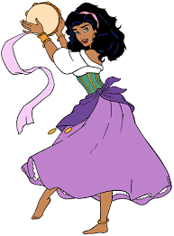
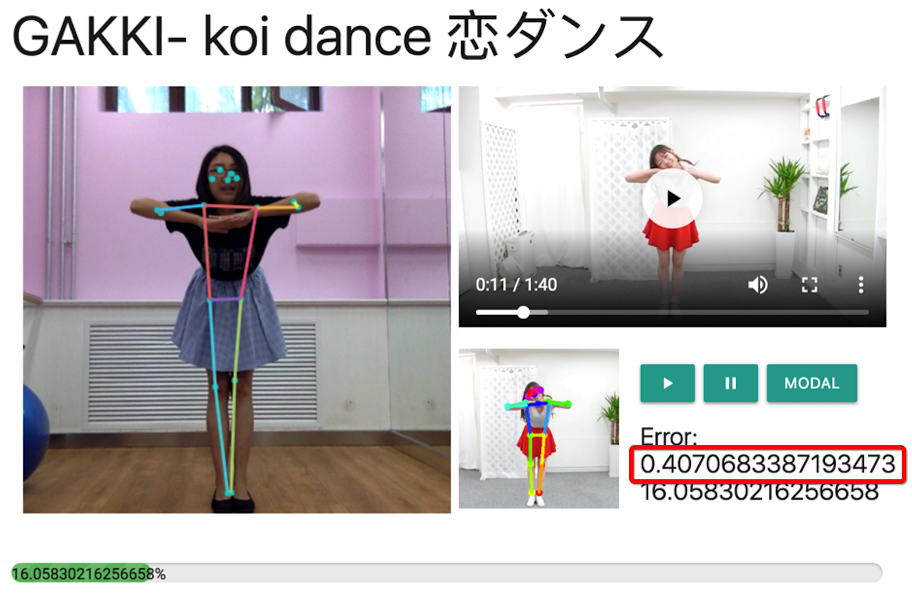
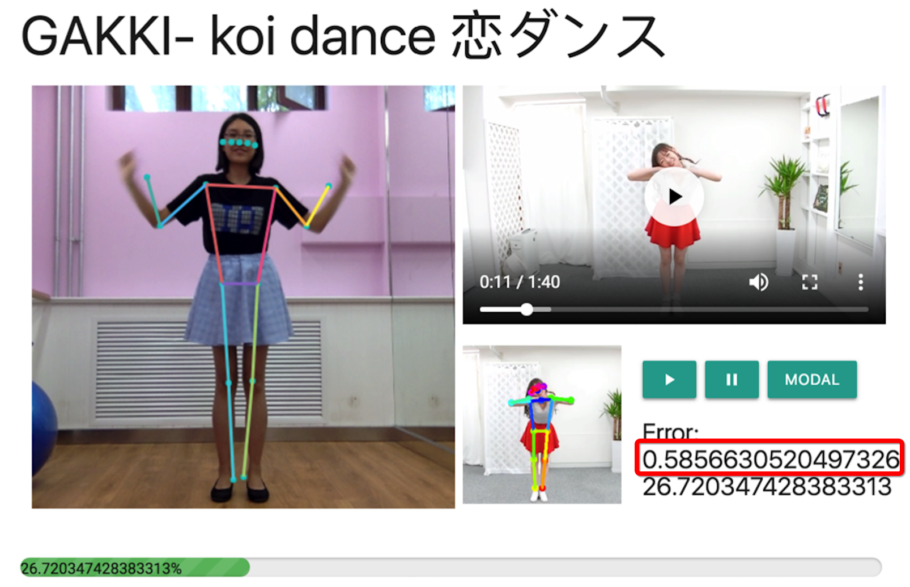

# ShallWeDance

**Shall We Dance** is a dancing teaching web application. The users dancing action will be scored based on the similarity between the action and the teaching video . After finishing the learning process, users can get a video which shows user dancing frames generated by GAN.

<div align=center>



</div>


The Mercari Hackathon project.

## Requirements

* Python 3.6
* Tornado 5.x
* Camera

## Installation

```
git clone
cd ShallWeDance
python server.py --port=8888
```

open browser and visit `localhost:8888` and the demo will be shown.

## Usage

### Dance teaching

#### 1. Tips

Keeping all your body (head, wrists and ankles, etc) captured by the camera will increase the precision of the ketpoints detection.

#### 2. Play/Pause the video

You can **press the play button** or **raise your right hand up** for playing the video.

You can **press the pause button** or **raise your left hand up** for playing the video.

#### 3. Scores

Every second, the similarity of your pose and the video will be calculated. And more similar poses achieve higher scores.

As the figures show, the pose of first fig is more similar with the pose of the teaching video, and the error is around 0.407, which is smaller than the 0.585.

<div align=center>






</div>

#### 4. Technology details

##### Keypoints

All the keypoints below are used. [OpenPose](https://github.com/CMU-Perceptual-Computing-Lab/openpose), a library for real-time multi-person keypoint detection and multi-threading written in C++ using OpenCV and Caffe is used for ketpoints detection in this app.

[tensorflow.js](https://github.com/tensorflow/tfjs) is applied for real-time detection and it can run on web. The keypoints of dancing teaching video was tagged offline using by [OpenPose Pytorch Version](https://github.com/tensorboy/pytorch_Realtime_Multi-Person_Pose_Estimation), which is more accurate but needs more time.

| Id   | Part          |
| ---- | ------------- |
| 0    | nose          |
| 1    | leftEye       |
| 2    | rightEye      |
| 3    | leftEar       |
| 4    | rightEar      |
| 5    | leftShoulder  |
| 6    | rightShoulder |
| 7    | leftElbow     |
| 8    | rightElbow    |
| 9    | leftWrist     |
| 10   | rightWrist    |
| 11   | leftHip       |
| 12   | rightHip      |
| 13   | leftKnee      |
| 14   | rightKnee     |
| 15   | leftAnkle     |
| 16   | rightAnkle    |

### Automated generated video

